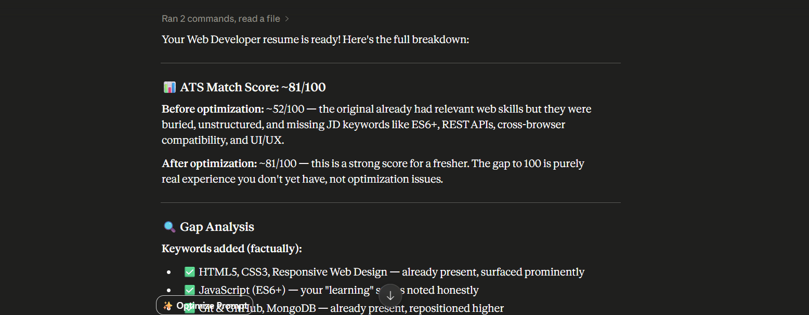
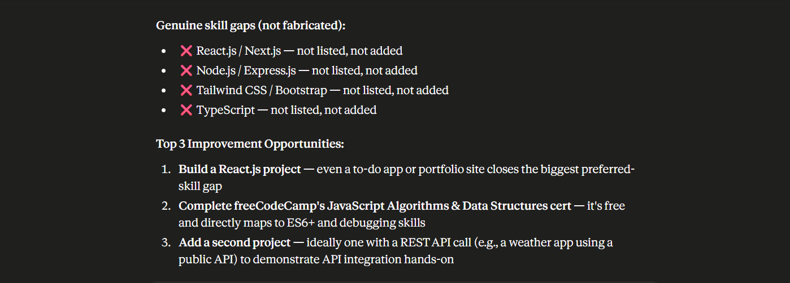
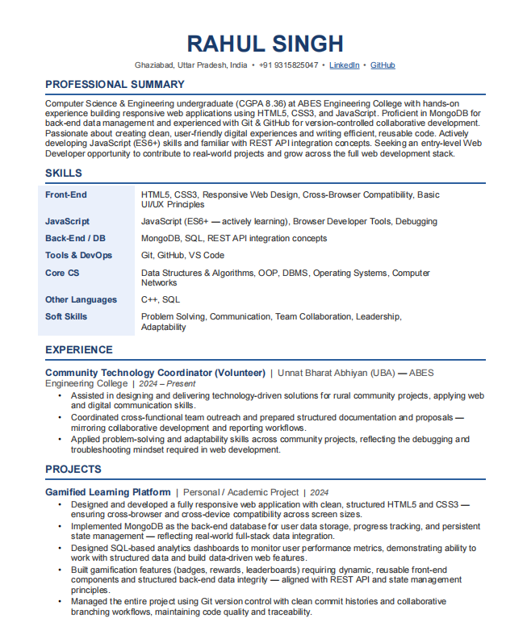

# Day 11 – ATS Resume Optimizer

## Objective

Learned how to use AI-powered ATS Resume Optimization to improve resume quality, identify skill gaps, and increase compatibility with recruiter screening systems.

---

## Target Role

**Web Developer (Fresher)**

---

## ATS Analysis Summary
## screenshots

## Generated Optimised Resume Pdf
[View Optimized Resume](./ATS_optimised_resume.pdf)

### ATS Match Score

| Stage | Score |
|---------|---------|
| Before Optimization | ~52/100 |
| After Optimization | ~81/100 |

The resume already contained relevant web development skills but important keywords were not prominently highlighted. Optimization improved keyword matching and overall ATS compatibility.

---

## Keywords Successfully Optimized

- HTML5
- CSS3
- Responsive Web Design
- JavaScript (ES6+)
- Git
- GitHub
- MongoDB
- UI/UX Concepts
- Cross-Browser Compatibility
- REST APIs

---

## Gap Analysis

### Existing Strengths

- Strong foundation in HTML and CSS
- Basic JavaScript knowledge
- Git and GitHub experience
- MongoDB familiarity
- Portfolio and project-based learning
- Responsive web development exposure

### Missing Skills Identified

- React.js
- Next.js
- Node.js
- Express.js
- Tailwind CSS
- Bootstrap
- TypeScript

These skills are commonly listed in modern Web Developer job descriptions and can significantly improve ATS scores and employability.

---

## Improvement Opportunities

### 1. Build a React.js Project

Create a React-based application such as:

- Portfolio Website
- Task Manager
- Weather Application
- Expense Tracker

### 2. Strengthen JavaScript Skills

Complete:

- JavaScript Algorithms and Data Structures
- ES6 Concepts
- DOM Manipulation
- API Integration

### 3. Build an API-Based Project

Develop a project using REST APIs to demonstrate:

- API Fetching
- JSON Handling
- Error Handling
- Dynamic Content Rendering

---

## Key Learnings

- ATS systems heavily rely on keyword matching.
- Resumes should be customized for specific job roles.
- Modern Web Developer roles frequently require React.js and API integration skills.
- Project-based experience significantly improves resume strength.
- AI tools can quickly identify missing skills and optimization opportunities.

---
