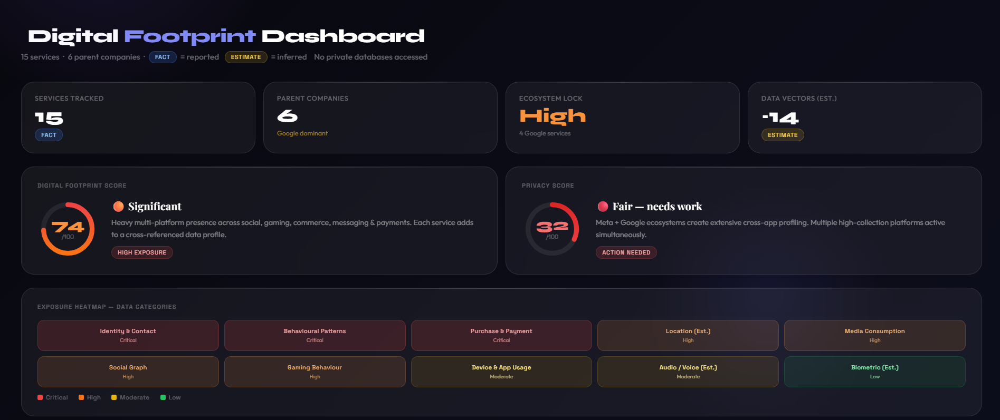
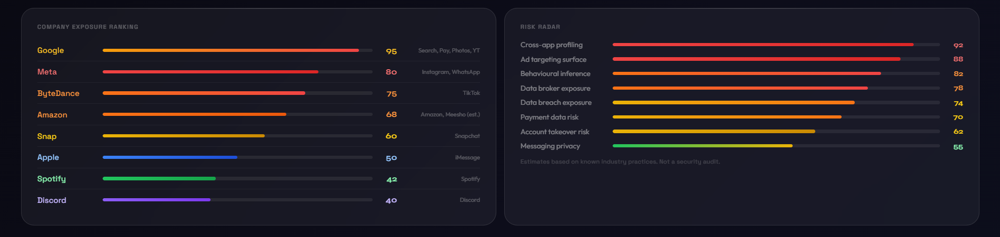
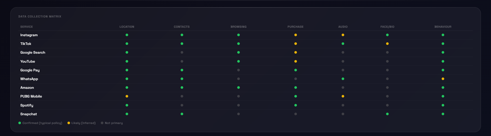
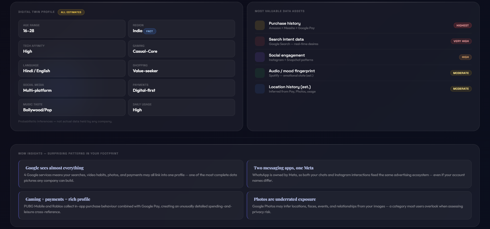
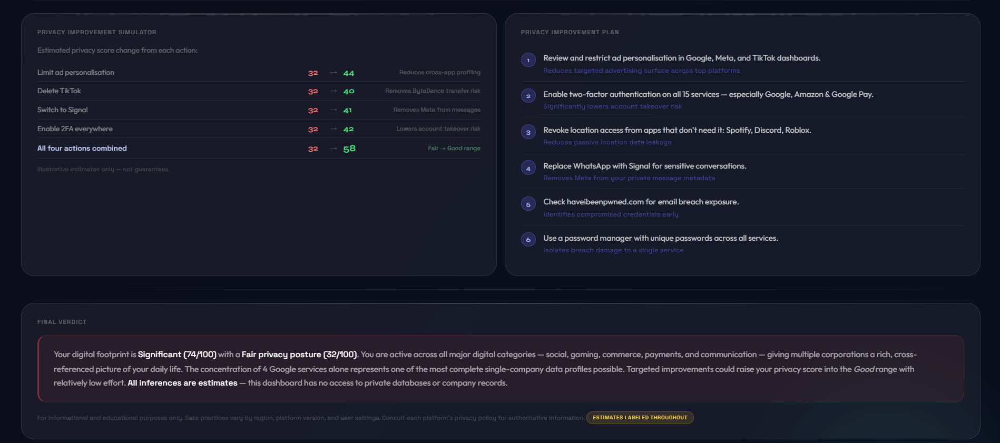

# Day 21 – Digital Privacy Dashboard

## Objective

Build and analyze a Digital Privacy Dashboard using Claude to understand digital footprints, privacy risks, and exposure levels.

## Screenshots

## Generated HTML Dashboard

[Digital Footprint Dashboard](./digital_footprint_dashboardd.html)

## Key Findings

* Evaluated Digital Footprint Score and Privacy Score.
* Analyzed Exposure Heatmap to identify high-risk areas.
* Reviewed Company Exposure Rankings.
* Explored Digital Twin Profile generation.
* Studied Risk Radar and Most Valuable Data Assets.
* Tested Privacy Improvement Simulator scenarios.

## Learnings

1. Digital footprints are created through everyday online activities.
2. Privacy settings significantly affect exposure levels.
3. Personal data has varying levels of value and risk.
4. Data aggregation can reveal detailed behavioral patterns.
5. Multi-factor authentication improves security posture.
6. Privacy audits help identify vulnerabilities.
7. Digital twins demonstrate the power of modern analytics.
8. Responsible data sharing reduces privacy risks.

## Conclusion

This project enhanced my understanding of digital privacy, data exposure, and cybersecurity awareness. The dashboard provided practical insights into managing personal information and reducing online risks through proactive privacy practices.

