## Day 22 of Claude Challenge -- Validate Your Startup Idea Like a VC

Startup success depends on solving real problems for real customers. Claude can help founders validate ideas, identify risks, understand customers, analyze competitors, and prioritize actions before building products.

1
Problem Validation: Determine whether the problem is painful enough to solve.
2
Market Research: Analyze opportunity size and market demand.
3
Founder-Market Fit: Assess how well your background aligns with the opportunity.
4
Execution Planning: Create actionable next steps for startup validation.

## Screenshots

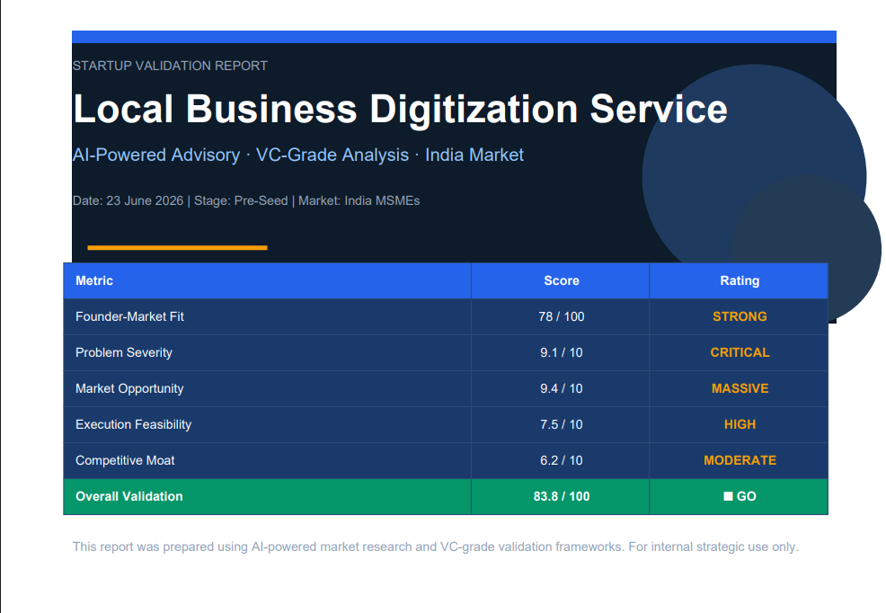

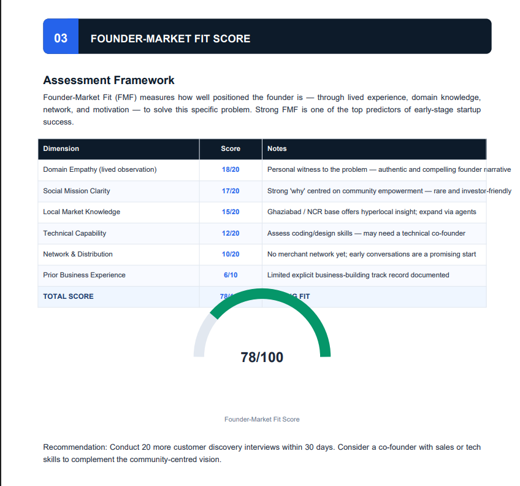

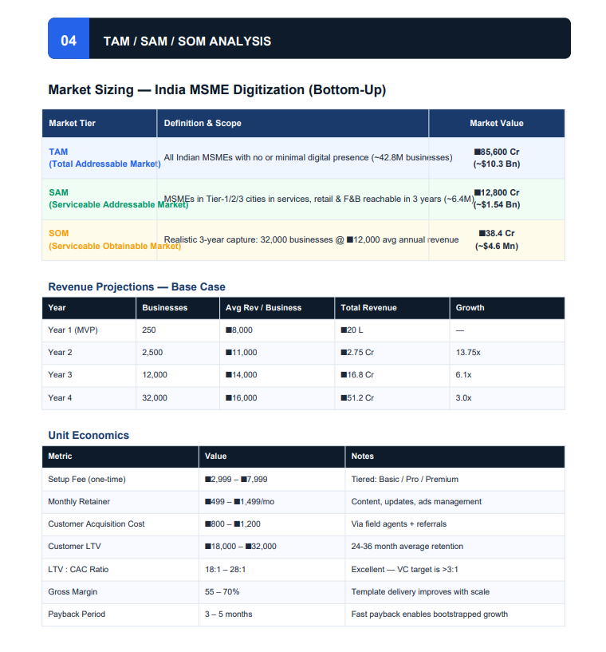

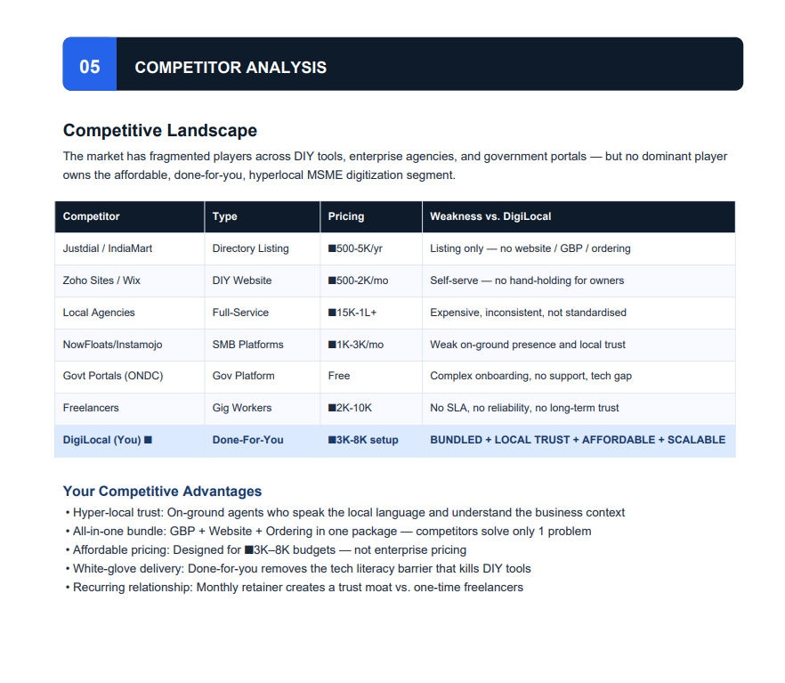

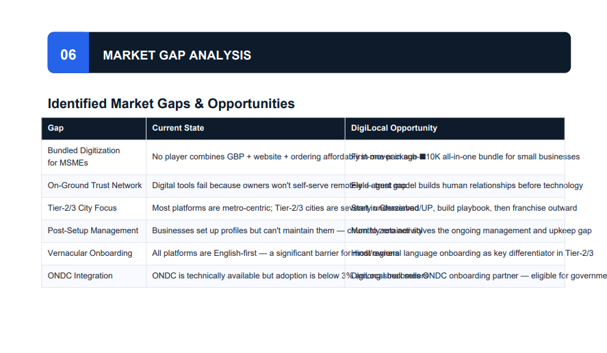

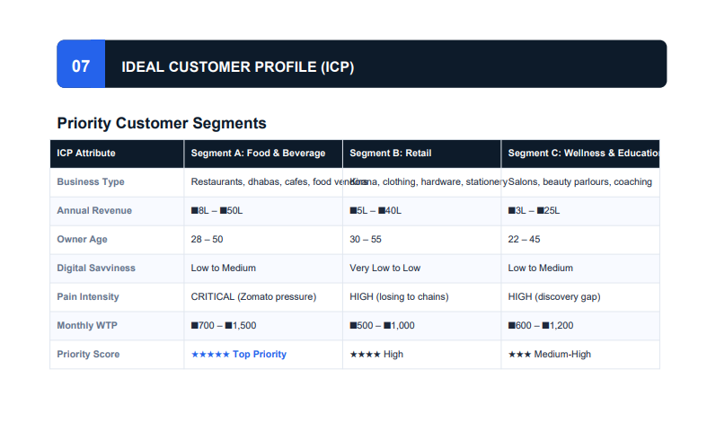

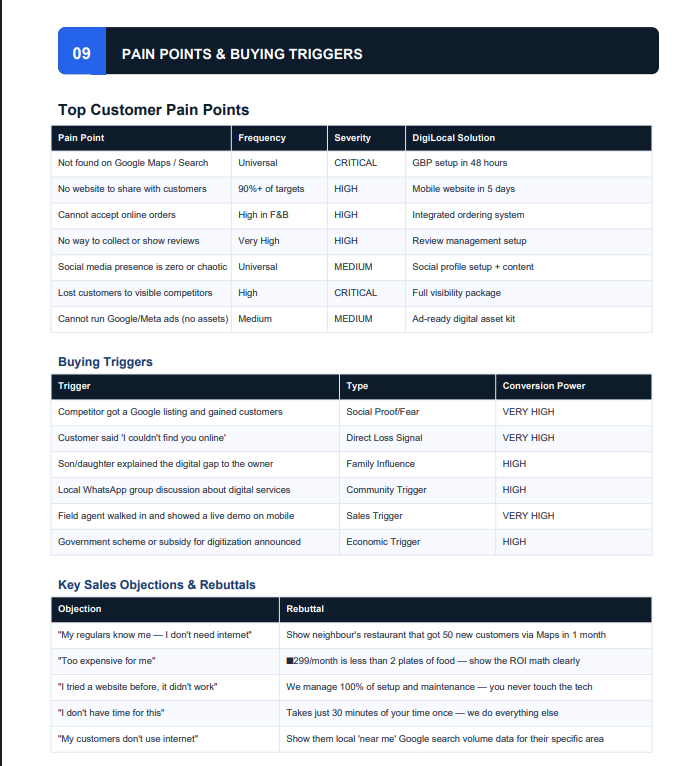

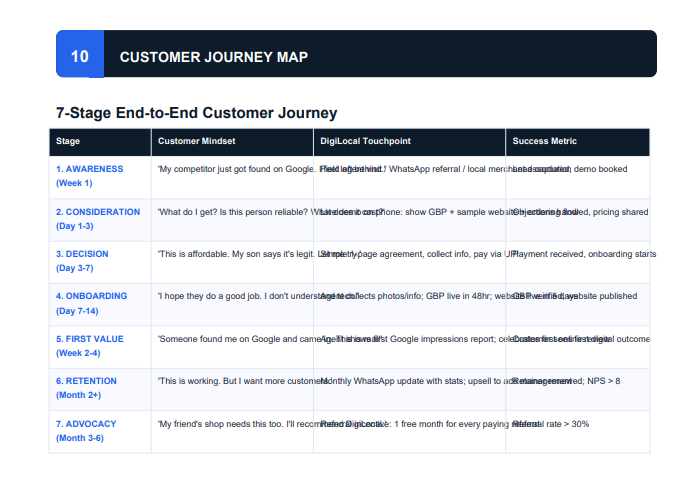

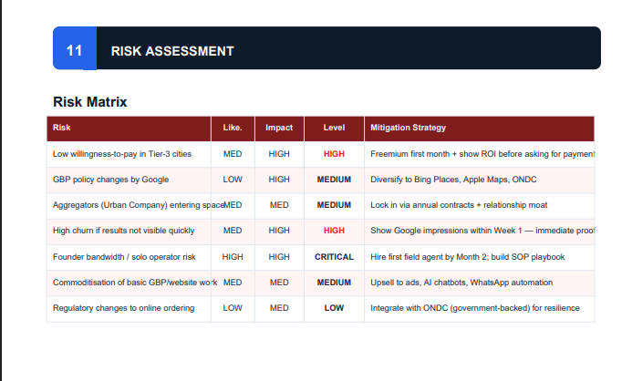

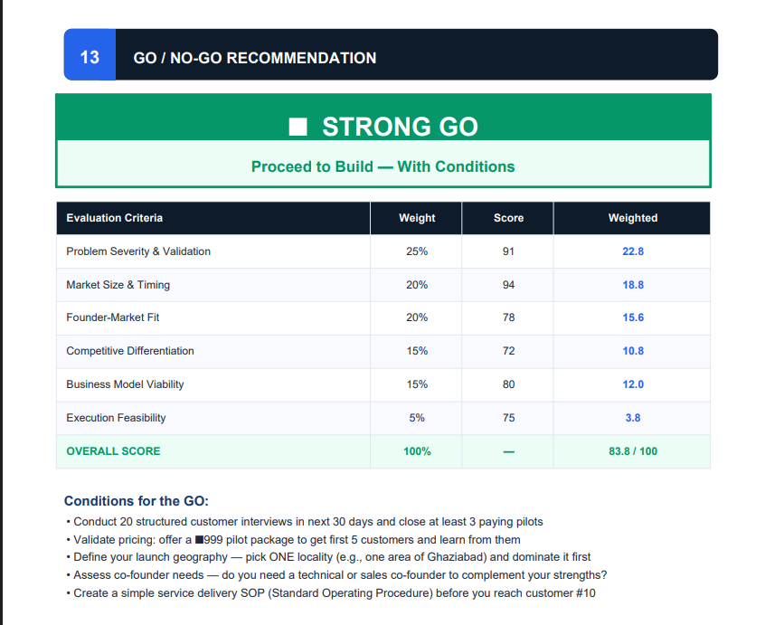

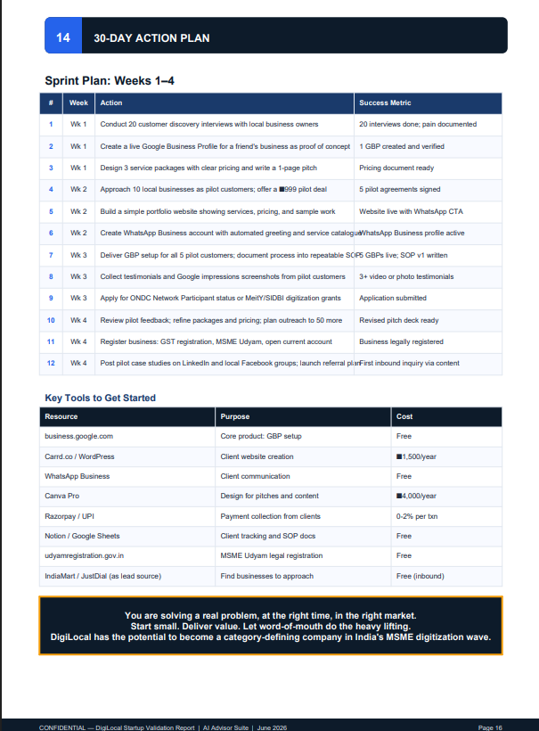

## Startup Idea Report

[Startup Validation Report PDF](./DigiLocal_Startup_Validation_Report.pdf)

## Key Learnings

1. Building a startup should start with solving a real customer problem rather than focusing only on the solution.

2. Many local businesses still lack a proper digital presence, including Google Business Profiles, websites, social media pages, and online customer engagement systems.

3. Customer validation is essential before investing significant time and resources. Conducting interviews and gathering feedback can help confirm market demand.

4. Understanding TAM, SAM, and SOM helped me estimate the market size and identify a realistic starting customer segment.

5. Competitor analysis revealed that while many agencies provide digital marketing services, there is a gap in affordable and simplified digitization solutions for small local businesses.

6. A clear Ideal Customer Profile (ICP) helps focus marketing efforts and customer acquisition strategies.

7. Every startup idea has risks, including customer acquisition challenges, competition, and proving return on investment to clients.

8. Founder-Market Fit is important because personal interest, experience, and understanding of the problem increase the chances of building a successful business.

9. Starting with a small pilot and a few customers is more practical than trying to serve a large market immediately.

10. A structured 30-day action plan can help convert an idea into a validated business opportunity through interviews, pilot projects, and continuous feedback.

