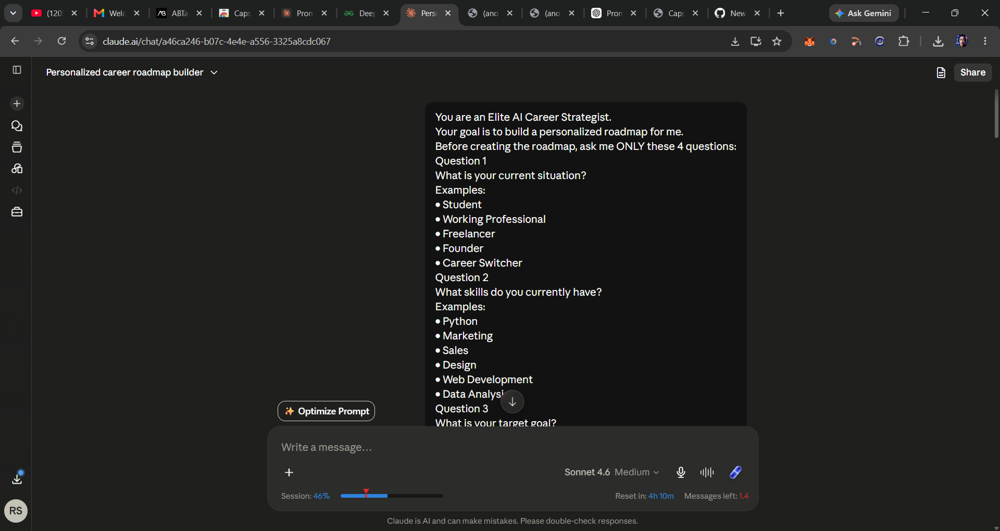
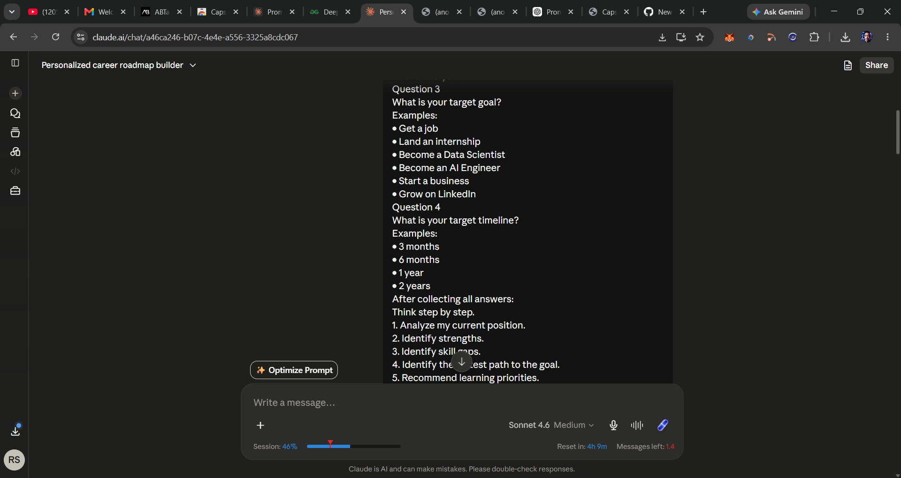
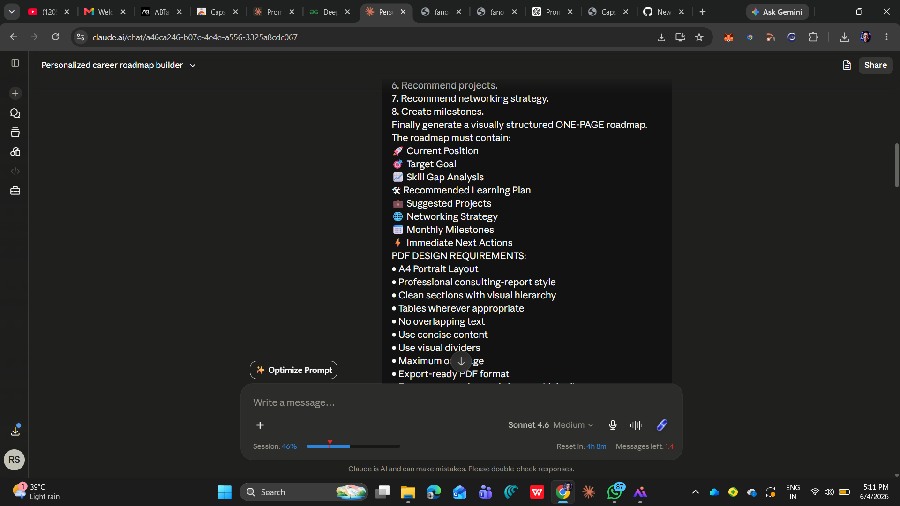
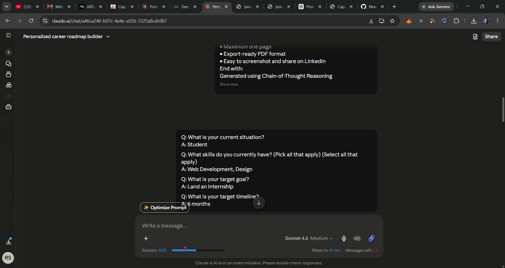

# Day 4 – Chain-of-Thought Prompting

## Today 's Objective

Learn how Chain-of-Thought Prompting helps AI reason step by step to generate a personalized career roadmap.

## What is Chain-of-Thought Prompting?

Chain-of-Thought (CoT) Prompting encourages AI to analyze information systematically before providing an answer. Instead of giving a generic response, the AI gathers context, identifies gaps, and generates a structured plan.

## Career Goal

Secure a Design / Web Development Internship within the next 6 months while building a strong portfolio and improving technical skills.

## Key Recommendations from the Roadmap

* Improve HTML, CSS, JavaScript, and responsive design skills.
* Learn Figma and UI/UX design principles.
* Build a portfolio website and showcase projects.
* Learn Git and GitHub workflows.
* Gain basic knowledge of React and modern frontend development.
* Network actively through LinkedIn, GitHub, and design/developer communities.
* Apply consistently for internships and prepare for interviews.

## Suggested Projects

1. Personal Portfolio Website
2. App UI Redesign Case Study
3. SaaS Landing Page Clone
4. React-Based Mini Application

## Biggest Insight

The most valuable insight was that landing an internship is not only about learning new technologies. Building a visible portfolio, maintaining an active GitHub profile, documenting projects through case studies, and networking consistently are equally important. The roadmap showed that small, focused actions performed every month can create significant progress toward achieving a career goal.

## Learnings

* AI can generate highly personalized career plans when given sufficient context.
* Chain-of-Thought prompting produces more structured and actionable outputs.
* Breaking a large goal into monthly milestones makes it easier to track progress.
* Project-based learning is more effective than focusing only on theoretical knowledge.
* Networking and personal branding play a major role in securing opportunities.

## Screenshots Included

* Chain-of-Thought prompt
* Questions and answers
* Generated career roadmap
* Biggest insight summary

## Conclusion

This exercise demonstrated how Chain-of-Thought Prompting improves AI reasoning and creates practical, personalized guidance. The roadmap provided a clear path for skill development, portfolio building, networking, and internship preparation.

# Screenshots

## Prompt Used

## Questions and Answers

## Generated Career Roadmap

📄 [Open the Career Roadmap PDF](career_roadmap_v2.pdf)

