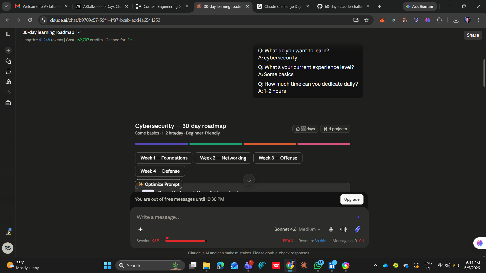
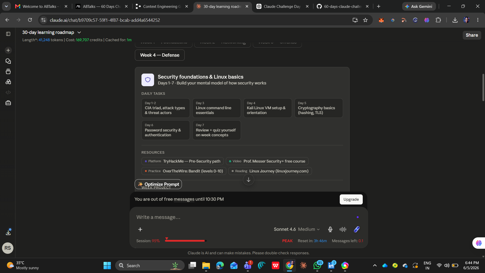
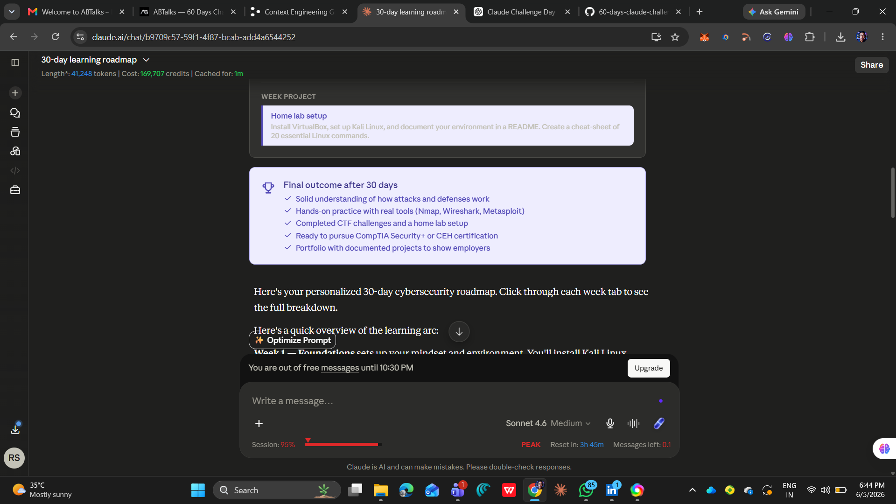
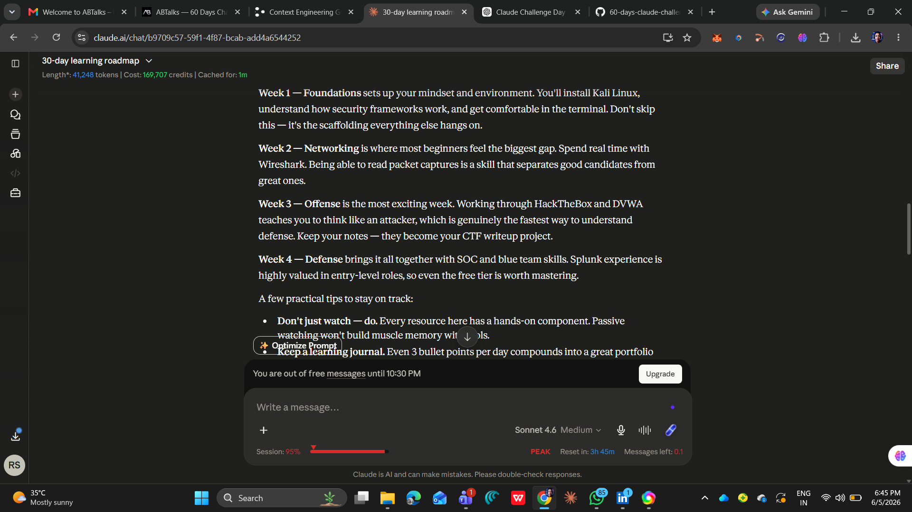
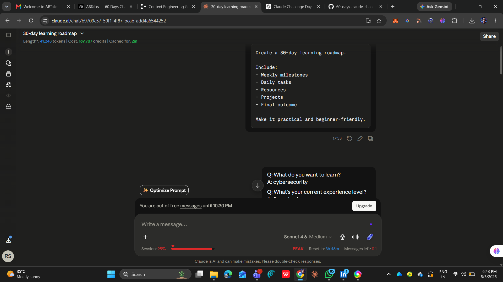
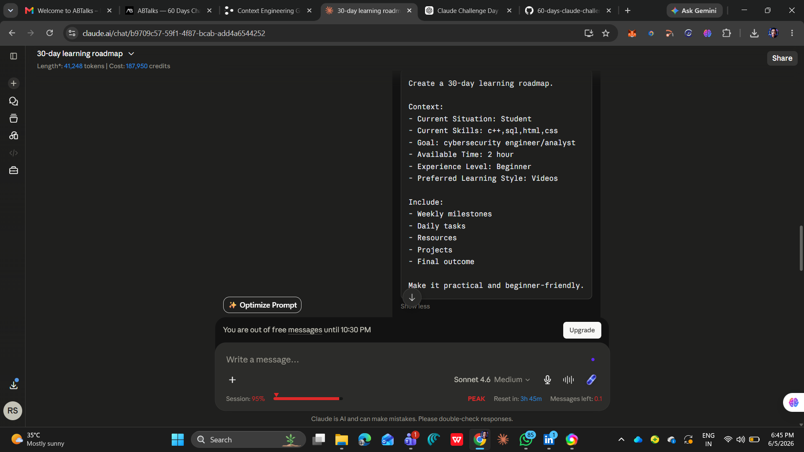
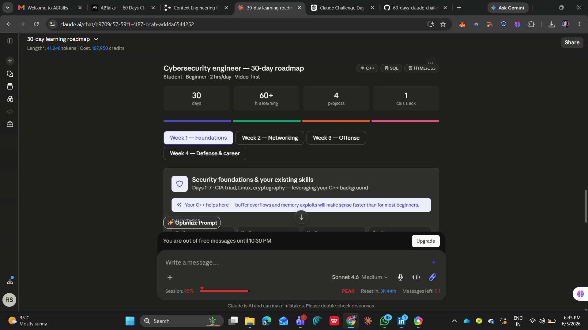
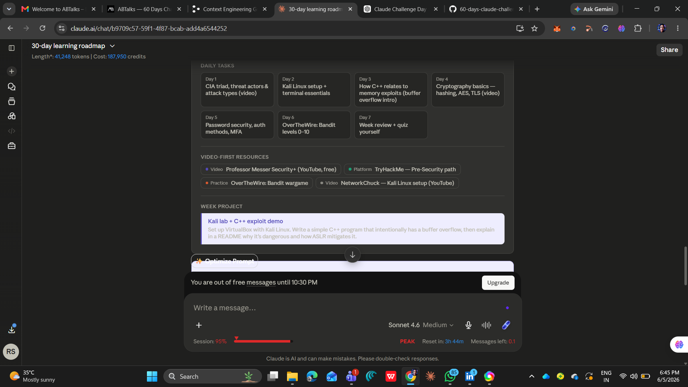
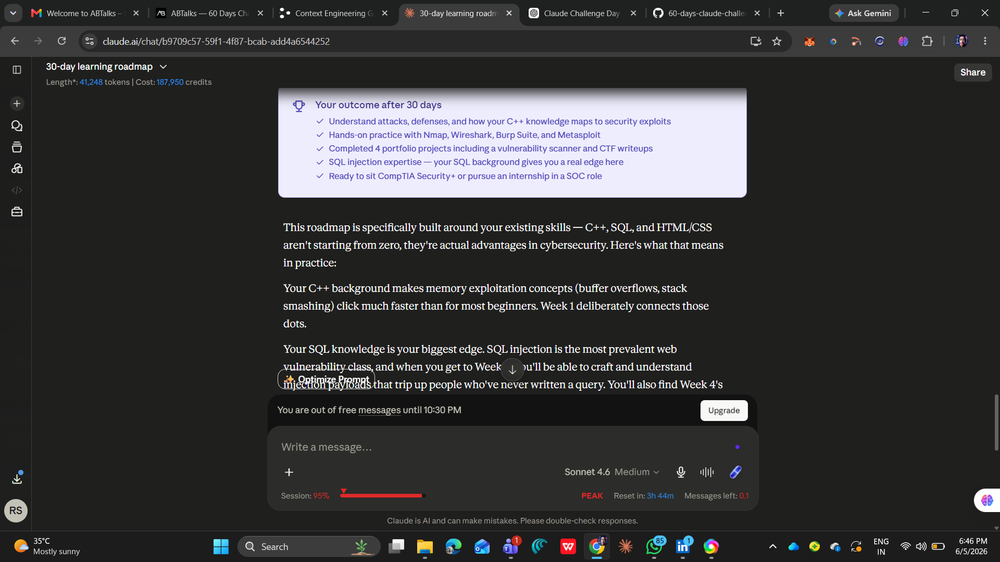
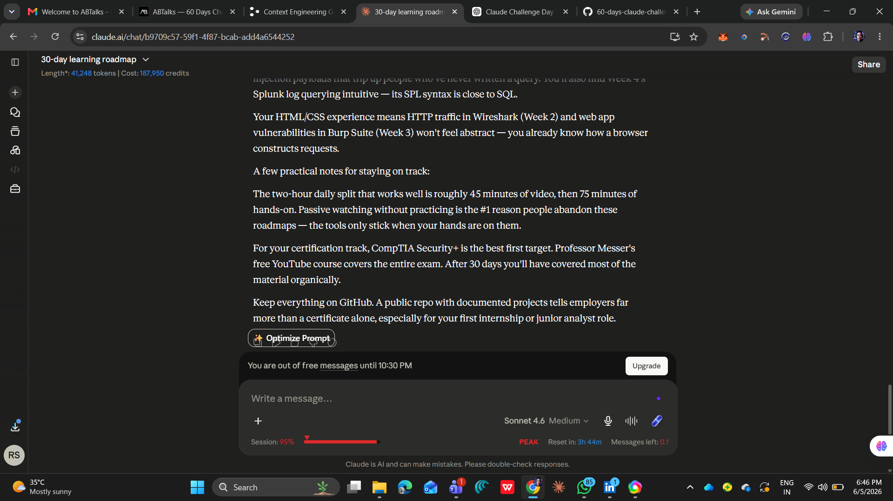

# Day5 of Claude Challenge

Today"s task is about learning Context Engineering

## CONTEXT ENGINEERING
Context Engineering is the practice of providing relevant information, constraints, background, goals, and user-specific details to AI before asking it to perform a task. The quality of context often matters more than the prompt itself.

Its Benefits are listed below

Personalized Outputs: Context allows Claude to generate recommendations tailored to your situation.

Higher Accuracy: Claude makes fewer assumptions when it understands the full picture.

Better Planning: Context enables more realistic and actionable roadmaps.

Real-world AI Systems: Modern AI agents rely heavily on context engineering, memory, and retrieval.

## PROMPT A(WITHOUT CONTEXT)
Create a 30-day learning roadmap.

Include:
- Weekly milestones
- Daily tasks
- Resources
- Projects
- Final outcome

Make it practical and beginner-friendly.

## OUTPUT

### Screenshots of claude chats

## PROMPT B(WITH CONTEXT)
Create a 30-day learning roadmap.

Context:
- Current Situation: [Student/Professional/Freelancer]
- Current Skills: [Add Skills]
- Goal: [Target Goal]
- Available Time: [Hours per Day]
- Experience Level: [Beginner/Intermediate]
- Preferred Learning Style: [Videos/Projects/Reading]

Include:
- Weekly milestones
- Daily tasks
- Resources
- Projects
- Final outcome

## OUTPUT

### Screenshots of cluade chats

### Key Differences

- Prompt A:
 Generated a generic response.
 Simple instructions with no context.
 AI needs to assume more.
 output was less tailored.

- Prompt B:
 Generated a more personalized response based on experience level.
 AI needs to assume less.
 context is provided with instructions.
 output is more tailored.
 

## Key Learnings

1. Adding context improves AI responses.
2. Specifying experience level changes the depth of explanation.
3. Detailed prompts produce more structured outputs.
4. Prompt engineering helps achieve more accurate results.

  
