## DAY 7 OF CLAUDE CHALLENGE

Today, i've come to know the uses and working of different model of claude.
They are different from each other is aspect of the task , complexity and their capablity.
Typically, there are three models-
1.haiku 2.sonnet 3.opus(in pro)

## MY STRATEGY 
[usage strategy ](./claude_strategy_creative_modern.pdf)

## SCREENSHOTS OF TOOL SETUP
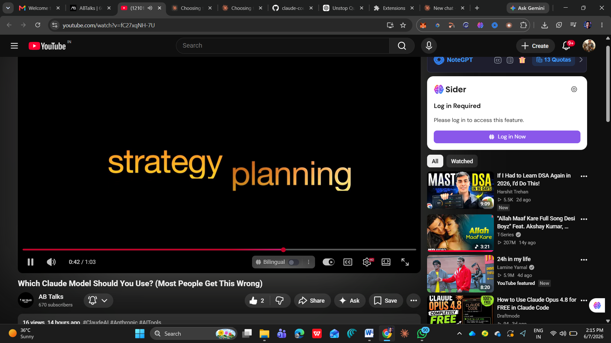
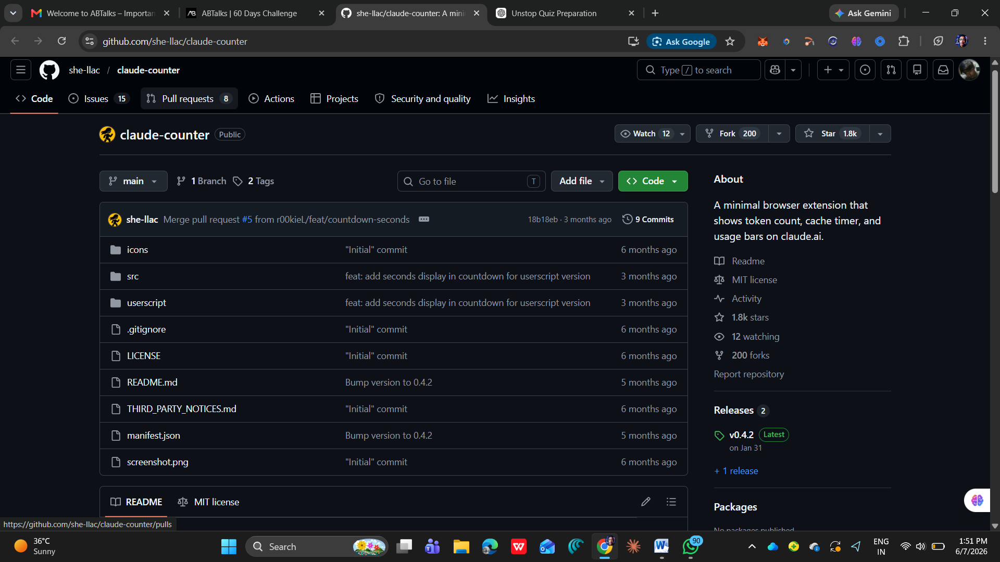
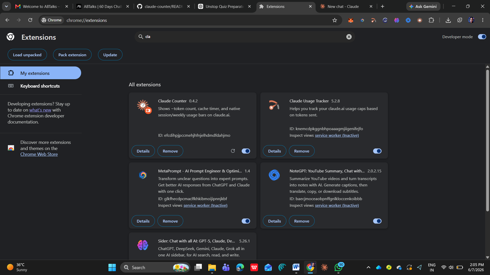
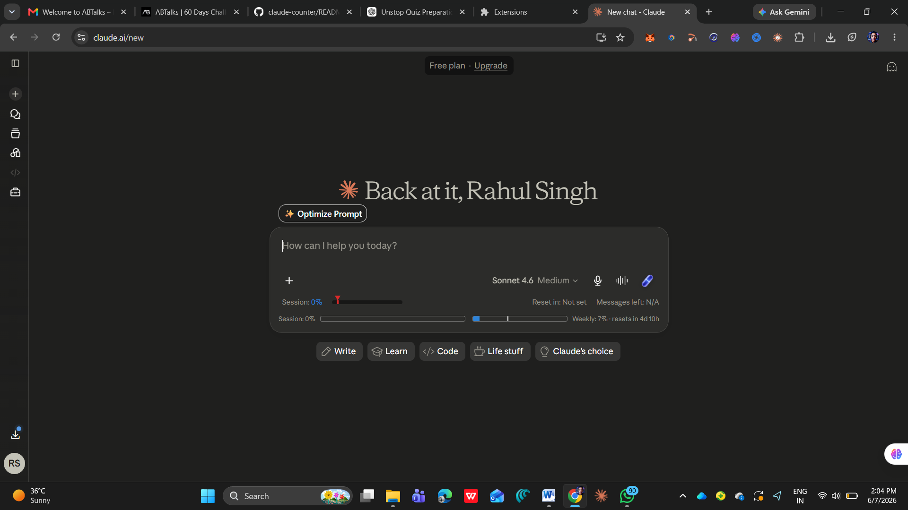

## CHAT SCREENSHOTS WITH CLAUDE AI
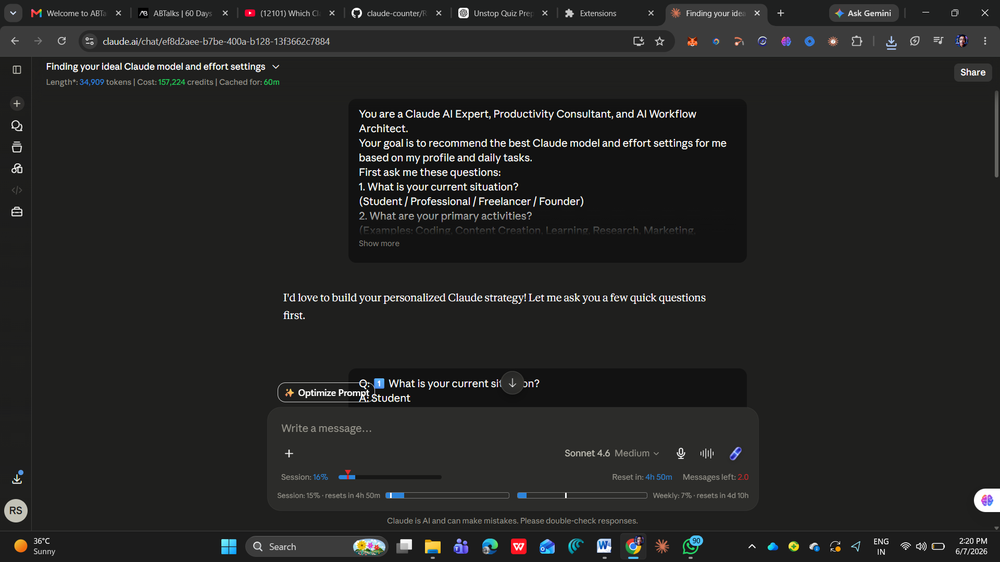
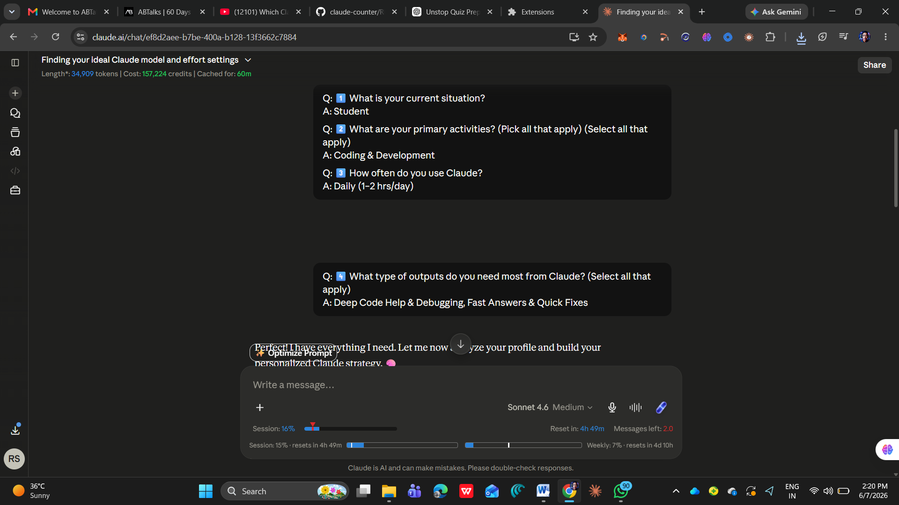
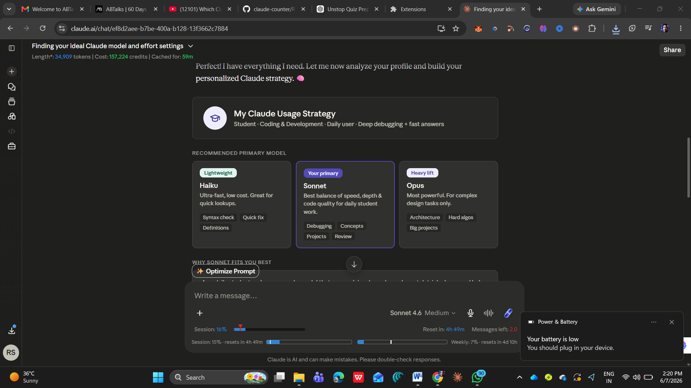
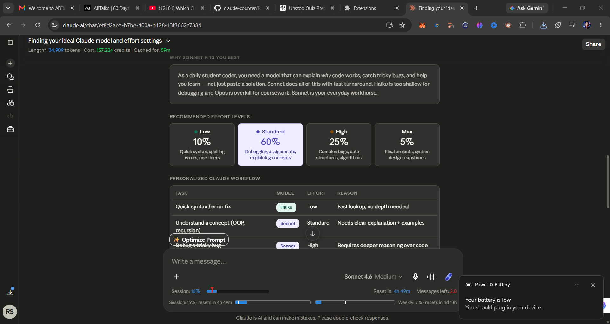
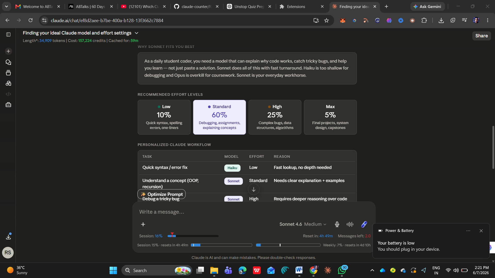
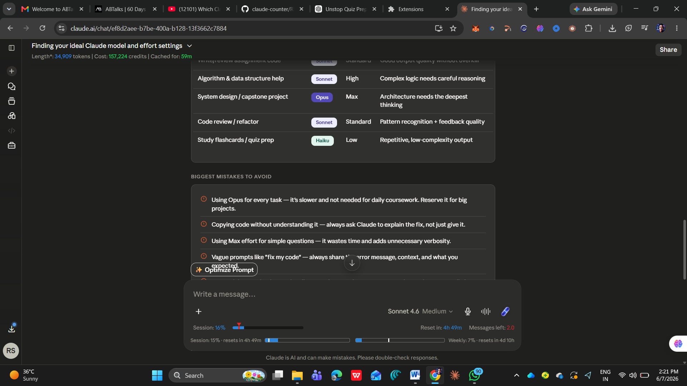
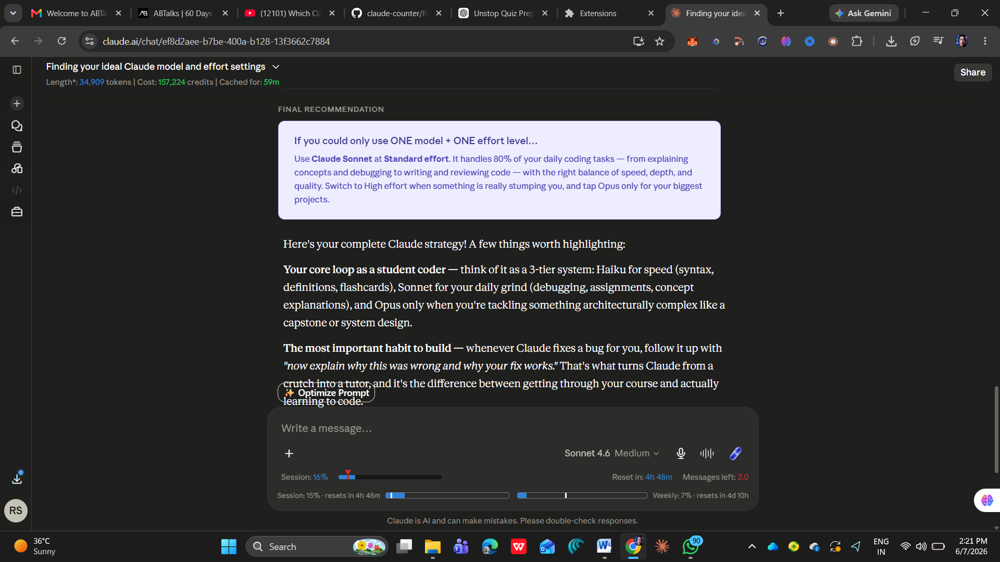
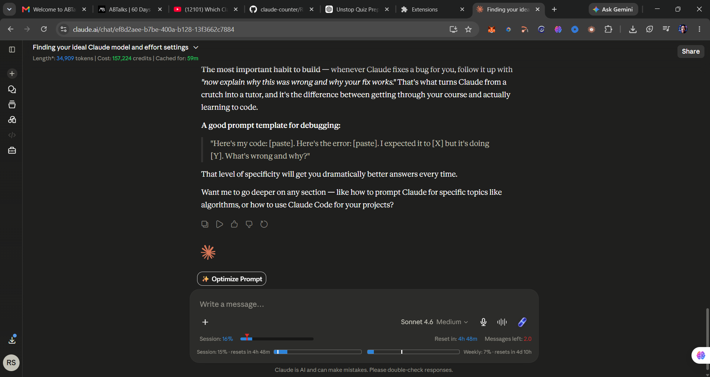

## MY WORKFLOW AFTER LEARNING THIS STRATEGY

I use Claude as a learning assistant, coding mentor, and productivity tool throughout my day.

### Step 1: Quick Queries

For syntax checks, definitions, and small coding errors, I use **Haiku with Low Effort** because it provides fast responses.

### Step 2: Learning and Understanding Concepts

When studying programming concepts, data structures, algorithms, or academic topics, I use **Sonnet with Standard Effort** to get detailed explanations and examples.

### Step 3: Coding and Debugging

For debugging code, reviewing assignments, and solving programming problems, I use **Sonnet with High Effort** to obtain deeper reasoning and more accurate solutions.

### Step 4: Assignments and Documentation

For writing reports, project documentation, UBA proposals, resumes, and LinkedIn posts, I use **Sonnet with Standard Effort** because it provides a balance between quality and speed.

### Step 5: Complex Projects

For final-year projects, system design tasks, and advanced planning activities, I switch to **Opus with Max Effort** to leverage the strongest reasoning capabilities.

### Step 6: Review and Improvement

Before submitting any work, I ask Claude to review, refine, and suggest improvements to ensure better quality and accuracy.

### Expected Benefits

* Faster learning
* Better coding skills
* Improved productivity
* Higher-quality documentation
* More effective project planning
* Better career preparation

